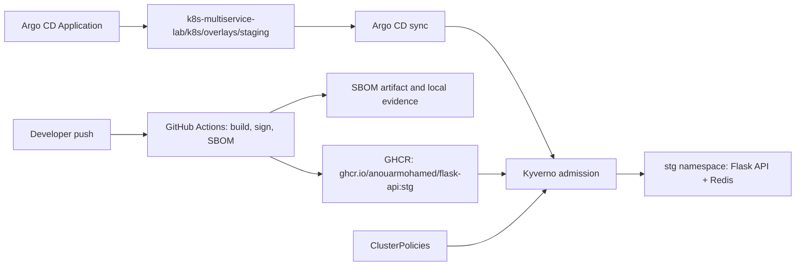

# GitOps Supply Chain Security Lab

[](https://github.com/AnouarMohamed/gitops-supply-chain-security/actions/workflows/validate.yml)

Companion security-control-plane lab for
[k8s-multiservice-lab](https://github.com/AnouarMohamed/k8s-multiservice-lab).

The app lab proves that a Flask API and Redis workload can be built, deployed,
and operated on Kubernetes. This repo extends that story into GitOps and supply
chain security: Argo CD deploys the app, Kyverno enforces admission controls,
Cosign verifies signed images, and Syft SBOM evidence documents what is running.

## Stack

| Layer | Choice |
| --- | --- |
| Local cluster | kind |
| GitOps | Argo CD Application |
| Admission control | Kyverno ClusterPolicies |
| Image trust | Sigstore Cosign keyless signatures |
| SBOM | Syft JSON evidence |
| Workload source | `AnouarMohamed/k8s-multiservice-lab` |

## Architecture



## What This Lab Proves

- GitOps delivery from the app repository into a Kubernetes staging namespace.
- Automated sync, pruning, self-healing, and namespace creation through Argo CD.
- Admission denial for root containers, `:latest` images, and missing resource
  limits.
- Keyless signature verification for the signed Flask API image built by GitHub
  Actions.
- SBOM evidence for the Flask API runtime image.
- Repeatable positive and negative policy demos for interviews, portfolios, or
  live walkthroughs.

## Quick Start

Use this path when starting from a clean Linux dev environment with Docker.

```bash
make lab-up
make evidence
```

Use this shorter path when Argo CD, Kyverno, and a Kubernetes context already
exist:

```bash
make doctor
make apply-policies
make deploy-app
make wait-app
make status
make test-policies
```

The Argo CD application deploys:

```text
repo:      https://github.com/AnouarMohamed/k8s-multiservice-lab.git
path:      k8s/overlays/staging
namespace: stg
image:     ghcr.io/anouarmohamed/flask-api:stg
```

## Common Commands

```bash
make validate          # static repo validation
make doctor            # local tool and cluster readiness checks
make install-chainsaw  # install pinned Kyverno Chainsaw locally
make chainsaw-test     # run declarative Chainsaw admission tests
make lab-up            # full local lab from cluster creation to evidence checks
make evidence          # write reports/evidence.md from the live cluster
make cluster-up        # create the kind lab cluster
make cluster-down      # delete the kind lab cluster
make install-kyverno   # install Kyverno with Helm
make install-argocd    # install Argo CD manifests
make apply-policies    # apply all Kyverno ClusterPolicies
make deploy-app        # create or update the Argo CD Application
make wait-app          # wait for Argo CD and Kubernetes rollouts
make status            # inspect Argo CD, Kyverno, policies, and stg workloads
make test-policies     # run positive and negative admission demos
make verify-image      # verify the Flask API image signature with Cosign
make verify-attestation # verify the SBOM attestation attached to the image
make digest-reference  # print the verified digest-pinned image reference
make sbom-summary      # summarize the checked-in Syft SBOM
```

## Repository Layout

```text
.
├── argocd-app.yaml                 # Argo CD Application for the app lab
├── kind-config.yaml                # Local two-node kind cluster
├── policy-*.yaml                   # Kyverno supply chain and runtime policies
├── flask-api-sbom.json             # Syft SBOM evidence for the Flask API image
├── docs/                           # Architecture, guide, evidence, demos
├── examples/                       # Allowed and denied admission test cases
├── reports/                        # Generated evidence reports stay local
├── scripts/                        # Repeatable lab automation
├── .github/workflows/validate.yml  # Repo validation workflow
└── Makefile                        # Main operator entrypoint
```

## Documentation

- [Architecture](docs/ARCHITECTURE.md)
- [Lab Guide](docs/LAB-GUIDE.md)
- [Policy Controls](docs/POLICIES.md)
- [Evidence](docs/EVIDENCE.md)
- [Chainsaw Tests](docs/CHAINSAW.md)
- [Attack Scenarios](docs/ATTACK-SCENARIOS.md)
- [Digest Pinning](docs/DIGEST-PINNING.md)
- [Demo Script](docs/DEMO-SCRIPT.md)
- [Troubleshooting](docs/TROUBLESHOOTING.md)

## GitHub About

Short description:

```text
GitOps supply chain security extension for a Kubernetes multiservice lab with Argo CD, Kyverno, Cosign, and SBOM evidence.
```

Topics:

```text
gitops kubernetes argocd kyverno sigstore cosign sbom syft supply-chain-security devsecops cloud-native
```
