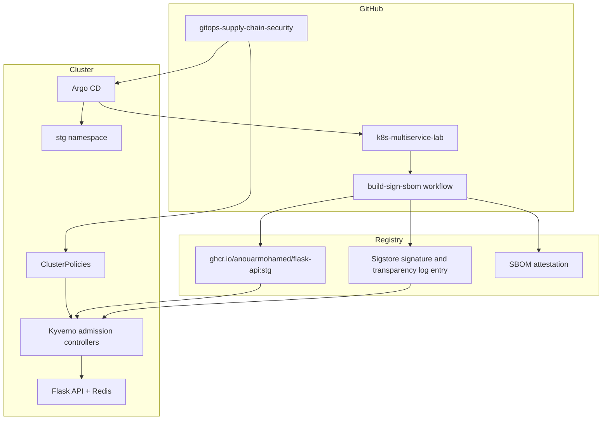

# Architecture

This repo is the security extension for the
`AnouarMohamed/k8s-multiservice-lab` application repo. The two repositories
share a simple contract:

| Concern | Source |
| --- | --- |
| App code, Dockerfile, Kustomize base, staging overlay | `k8s-multiservice-lab` |
| Image build, GHCR push, Cosign signing, SBOM generation | `k8s-multiservice-lab` GitHub Actions |
| GitOps deployment, admission policies, evidence, demos | this repo |

## Control Plane



## Trust Chain

1. The app repo builds the `flask-api` container in GitHub Actions.
2. The workflow pushes `ghcr.io/anouarmohamed/flask-api:stg`.
3. The workflow signs the image with Sigstore keyless identity using the GitHub
   OIDC issuer.
4. The Kyverno signature policy only accepts images matching the expected
   workflow identity:

   ```text
   issuer:  https://token.actions.githubusercontent.com
   subject: https://github.com/AnouarMohamed/k8s-multiservice-lab/.github/workflows/build-sign-sbom.yml@refs/heads/main
   ```

5. Argo CD syncs the staging Kustomize overlay into namespace `stg`.
6. Kyverno evaluates Pods before admission. Bad runtime settings or untrusted
   Flask API images are denied before they run.

## Runtime Boundary

The app repo already defines Kubernetes hardening inside the workload:

- non-root API and Redis containers
- resource requests and limits
- `readOnlyRootFilesystem` for the API
- default-deny NetworkPolicies
- ResourceQuota, LimitRange, PDB, and HPA

This repo adds cluster-level guardrails so those controls are not just good
manifests in Git. They become enforced admission requirements.

## Why Argo CD Ignores The API Image Field

`argocd-app.yaml` includes an `ignoreDifferences` entry for the Flask API image.
That keeps the lab compatible with image-update workflows where an external
controller or CI step updates the live image reference. Argo CD still owns the
application shape, namespace, services, Redis deployment, quotas, and policy
guardrails.

For a stricter production model, remove that ignore rule and update image tags
only through Git commits.
